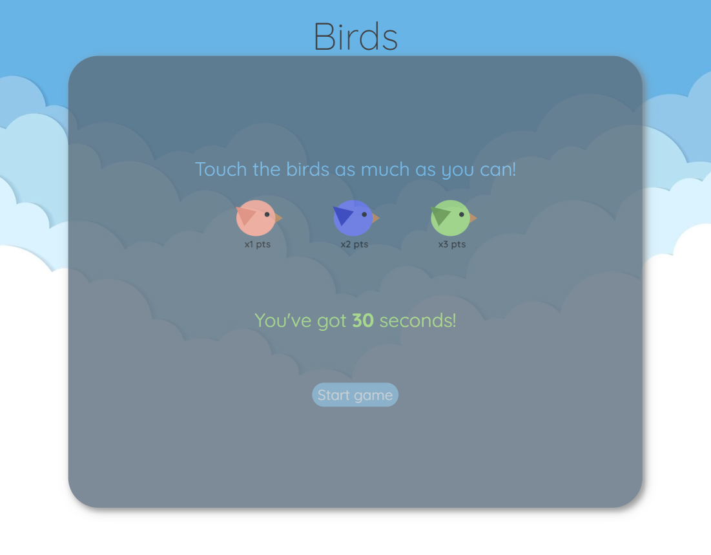
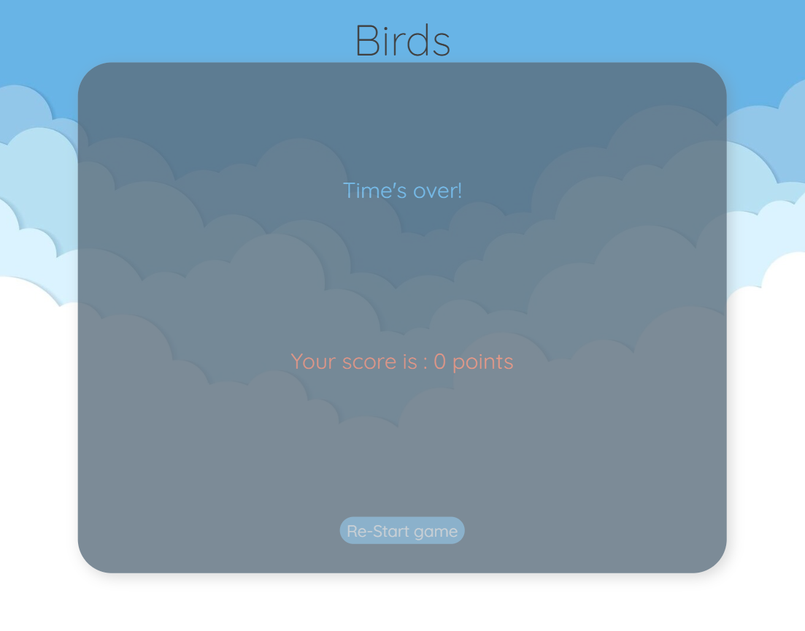

# Birds

[Birds website](https://kimrv000.github.io/birds/)

## Specifications

Birds was developed using:

- HTML5
- CSS
- JavaScript

It's a responsive project sketched in Figma following the mobile-first design.

## Game 

To play Birds, click on as many birds as possible in 30 seconds to earn points.   

Each bird color has a different point value.  

At the end you will be able to see your final score.

